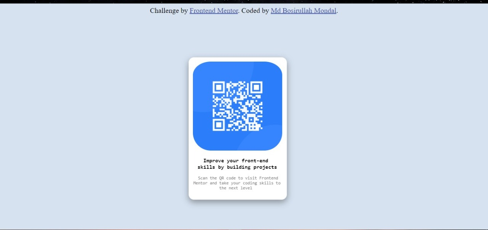

# Frontend Mentor - QR code component solution

This is a solution to the [QR code component challenge on Frontend Mentor](https://www.frontendmentor.io/challenges/qr-code-component-iux_sIO_H). Frontend Mentor challenges help you improve your coding skills by building realistic projects. 

## Overview

### Screenshot

### Links

- Solution URL: [https://github.com/bosirullah/qr-code-website]
- Live Site URL: [https://bosirullah.github.io/qr-code-website/]

## My process

### Built with

-HTML
-CSS

## Author

- Website - [https://bosirullah.github.io/qr-code-website/]
- Frontend Mentor - [https://www.frontendmentor.io/profile/bosirullah]

